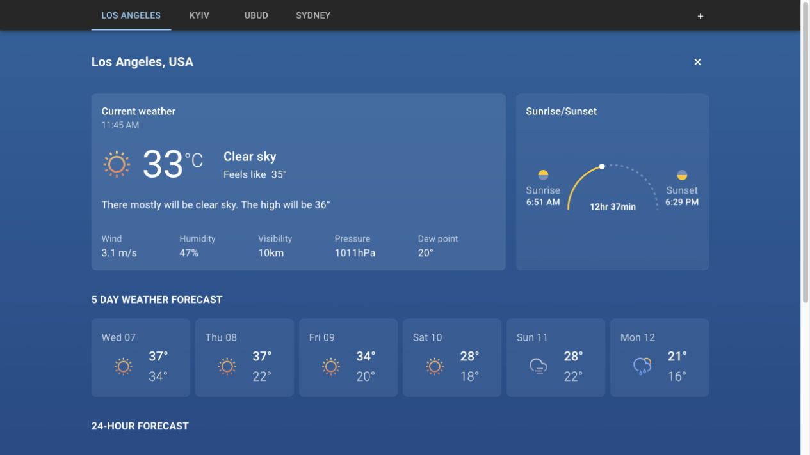

# Weather App

A React and TypeScript weather dashboard for checking current conditions and forecasts across saved cities. Built with Redux Toolkit, Material UI, Chart.js, Axios, and Vite.

[Open the live demo](https://vd-react-weather-app.vercel.app/) · [Run locally](#run-locally) · [Tests](#tests)



## What you can do

- Switch between saved cities and search for another city with autocomplete suggestions.
- View temperature, feels-like temperature, wind, humidity, visibility, pressure, and sunrise/sunset times.
- Compare daily forecasts and inspect a temperature chart for the next 24 hours.
- Add or remove cities and keep the list in browser storage between visits.
- Open readable city routes such as `/los-angeles-usa`.

The live demo does not require an account. Running your own copy requires access to the weather and city-search services described below.

## Run locally

Use Node.js 24.x, as specified in `package.json`, and npm.

```sh
git clone https://github.com/VladislavDegtyarenko/react-weather-app.git
cd react-weather-app
npm ci
```

Supply these environment variables through your shell or hosting platform:

| Variable | Purpose |
| --- | --- |
| `VITE_WEATHER_API_KEY` | OpenWeather access for current weather and the five-day forecast. |
| `VITE_RAPID_API_KEY` | RapidAPI access to GeoDB Cities for autocomplete suggestions. |

For a local terminal session, replace the placeholders before running:

```sh
export VITE_WEATHER_API_KEY="your-openweathermap-key"
export VITE_RAPID_API_KEY="your-rapidapi-key"
npm run dev
```

Open the local URL printed by Vite. The development command also exposes the server on your local network. The same variables must be available when building the app.

This is a frontend-only project: service keys supplied at build time are included in the browser application. They are not server-side secrets. Do not use unrestricted private credentials; a production deployment that needs secret credentials requires a server-side proxy.

## Commands

| Command | Purpose |
| --- | --- |
| `npm run dev` | Start Vite for local development. |
| `npm run build` | Check TypeScript and create the production bundle in `dist/`. |
| `npm run build--watch` | Check TypeScript once and rebuild the Vite bundle as files change. |
| `npm run preview` | Serve an existing production build locally. |
| `npm test -- --runInBand` | Run the Jest test suite in one process. |

## Tests

The existing Jest and React Testing Library tests cover:

- City route generation, punctuation, non-Latin names, duplicate city names, and malformed routes.
- Redirects, city-tab navigation, unknown routes, and an empty city list.
- Adding and removing cities in the Redux store.

These are local unit and component tests. They do not verify live provider availability or the complete deployed application. There is no lint command configured.

For a manual check, open the demo, switch city tabs, add a city, reload to check the saved list, and visit an unknown city route.

## How it works

- [`src/Router.tsx`](src/Router.tsx) and [`src/functions/cityRoute.tsx`](src/functions/cityRoute.tsx) connect readable URLs to saved cities. Duplicate city/country pairs include an ID to keep routes distinct.
- [`src/store/weatherSlice.tsx`](src/store/weatherSlice.tsx) manages the city list and fetched data. The listener configured in [`src/store/store.tsx`](src/store/store.tsx) saves the city list to browser storage when cities are added or removed.
- [`src/api/`](src/api/) contains provider settings; [`src/hooks/`](src/hooks/) handles requests and forecast data.
- [`src/components/CityPage/`](src/components/CityPage/) separates current conditions, daily forecasts, sunrise/sunset, and charts into interface components.

Keeping routes and state logic outside the display components makes those behaviors testable without relying on a live weather service.

## Limitations

Data availability depends on the configured provider access and request limits. The current request hooks log failures to the browser console; they do not provide a complete retry and error-message flow. Forecast points come from OpenWeather's five-day, three-hour forecast endpoint, rather than minute-by-minute observations.

Saved cities belong to the current browser and site address. There is no account-based synchronization.

## Credits

Weather icons: [Weather Icons Kit on Figma](https://www.figma.com/file/EVL8LBbc5ff80KX4Z6j8AR/Weather--Icons-Kit-(Community)?type=design&node-id=0-1&t=LOWOu1H55WcRA7Pj-0).
